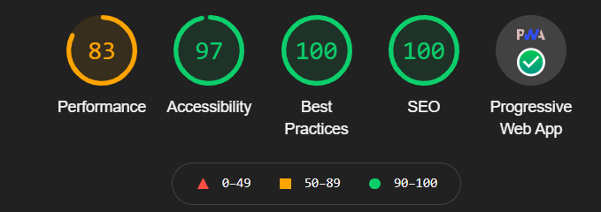

# PEC5

Este readme sirve para explicar lo que se requiere en los ejercicios.
Aplicación desplegada en https://christianmsuoc.github.io/frontend_avanzado_PEC5/

### Ejercicio 1

El service worker funciona perfectamente en la pantalla inicial de home y presenta alguna 
inconsistencia en el resto de pantallas de la aplicación.

Informe de Lighthouse:

En cuanto a performance se puede mejorar algo debido a que `Largest Contentful Paint (LCP)` esta 
por encima de los 2.5 segundos, lo cual hace que baje mucho dicha metrica. Se ha revisado y no se ha 
encontrado un motivo claro puesto que normalmente esta métrica esta asociada a imágenes videos el cual
no se carga.

Se puede ver que se detecta como PWA correctamente.

### Ejercicio 2

Ficheros asociados a Angular Universal.

Fichero | Contenido
--- | ---|
src/app/app.server.module.ts | Se define el modulo de servidor que se desplegara con su contenido
src/main.server.ts | Inicializa el entorno del servidor 
server.ts | Servidor de express que despliega la aplicación

